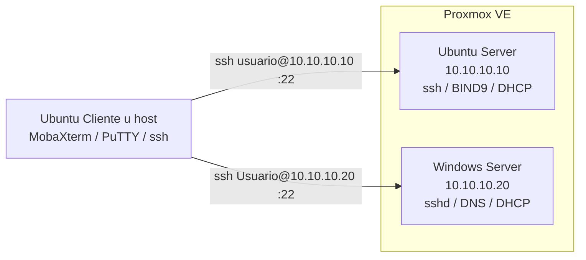

# Práctica 4 — SSH remoto y refactorización modular

## 1. Portada y control de versiones

| Campo | Dato |
| --- | --- |
| **Título** | Acceso remoto SSH y reingeniería modular de las prácticas 1–3 |
| **Integrantes** | *[Completar nombres]* |
| **Carrera** | *[Completar]* |
| **Asignatura** | Administración de sistemas / SysAdmin |
| **Fecha de entrega** | 25 de agosto de 2026 |
| **Entorno** | Proxmox VE — Windows Server, Ubuntu Server, Ubuntu Cliente |

### Registro de cambios

| Versión | Fecha | Autor | Descripción de la modificación |
| --- | --- | --- | --- |
| 1.0 | 2026-08-25 | *[Completar]* | OpenSSH en Linux/Windows, firewall TCP/22, bibliotecas de funciones y menú único. |
| 1.1 | 2026-08-25 | *[Completar]* | Refactor: migración de diagnóstico, DHCP y DNS a archivos `*_functions` / `Funciones*.ps1`. |

**Rúbrica (recordatorio):** 30 % SSH · 40 % refactorización (funciones + módulos; se penaliza código lineal) · 15 % GitHub (commits descriptivos) · 15 % documentación y evidencias **estrictamente por sesión SSH**.

---

## 2. Introducción y topología de red

Tras DHCP y DNS, el laboratorio debe administrarse **sin consola de Proxmox**. OpenSSH Server en Ubuntu y la característica OpenSSH Server en Windows exponen el puerto **22**. El cliente (Terminal, **PuTTY** o **MobaXterm**) es el único punto de operación a partir del hito crítico.



---

## 3. Arquitectura de software

Los scripts lineales de las Prácticas 1–3 se conservan como **referencia “antes”**. El código **operativo** vive en `Practica 4/`: un menú carga bibliotecas con `source` (Bash) o `.` (PowerShell).

### 3.1 Mapa de archivos del repositorio

```
SysAdmin/
├── Practica 1/                          # Antes: scripts lineales de diagnóstico
│   ├── diagnostico-ubuntuserver.sh
│   ├── diagnostico-ubuntucliente.sh
│   └── diagnostico-windowsserver.ps1
├── Practica 2/                          # Antes: DHCP lineal
│   ├── linux/configurar-dhcp.sh
│   └── windows/Configurar-Dhcp.ps1
├── Practica 3/                          # Antes: DNS lineal
│   ├── linux/configurar-dns.sh
│   └── windows/Configurar-Dns.ps1
└── Practica 4/                          # Después: módulos + SSH + menú único
    ├── DOCUMENTO.md
    ├── linux/
    │   ├── main.sh                      # único punto de entrada Linux
    │   └── lib/
    │       ├── funciones_comunes.sh     # verificar_root, validar_ipv4, instalar_paquete
    │       ├── diagnostico_functions.sh
    │       ├── dhcp_functions.sh
    │       ├── dns_functions.sh
    │       └── ssh_functions.sh
    └── windows/
        ├── Main.ps1                     # único punto de entrada Windows
        └── lib/
            ├── FuncionesComunes.ps1
            ├── FuncionesDiagnostico.ps1
            ├── FuncionesDhcp.ps1
            ├── FuncionesDns.ps1
            └── FuncionesSsh.ps1
```

Carga de bibliotecas (obligatorio):

```bash
# main.sh
source "${SCRIPT_DIR}/lib/funciones_comunes.sh"
source "${SCRIPT_DIR}/lib/dns_functions.sh"
dns_configurar
```

```powershell
# Main.ps1
. (Join-Path $Lib 'FuncionesDns.ps1')
Install-DnsRole
```

### 3.2 Cuadro comparativo de refactorización

| Aspecto | Antes (lineal, P1–P3) | Después (modular, P4) |
| --- | --- | --- |
| Punto de entrada | Un `.sh` / `.ps1` por práctica, copiar-pegar | `main.sh` / `Main.ps1` con menú |
| Validar IPv4 | Función duplicada en DHCP y DNS | `validar_ipv4` / `Test-IPv4` en comunes |
| Instalar paquetes | `apt-get` incrustado en cada script | `instalar_paquete` / `Install-DnsRole` |
| Root / Admin | `[[ $EUID -eq 0 ]]` repetido | `verificar_root` / `Assert-Administrator` |
| DNS Linux | Todo en `configurar-dns.sh` (~470 líneas) | `dns_instalar`, `dns_escribir_zona`, `dns_validar_sintaxis` |
| SSH | No existía | `ssh_instalar` + `Enable-SshFirewallRule` |

**Antes (fragmento lineal de DNS):** instalación, `cat <<EOF` de zona y `systemctl` en el mismo archivo, sin `source`.

**Después:**

```bash
dns_instalar          # bind9 + bind9utils + bind9-doc (idempotente)
dns_escribir_zona     # named.conf.local + db.reprobados.com
dns_validar_sintaxis  # named-checkconf / named-checkzone
enable_and_start named
```

```powershell
Install-DnsRole
Set-DnsRecordA -Name '@' -Ip $ipObjetivo
Set-DnsRecordCname -Name 'www' -Alias 'reprobados.com.'
```

---

## 4. Manual de instalación y uso

### Pre-requisitos

- Las tres VMs de Proxmox con IPs del laboratorio.
- Git (para clonar y dejar evidencia de commits).
- **Última** sesión de consola de Proxmox: copiar `Practica 4` y ejecutar la opción SSH.
- Cliente gráfico recomendado: **MobaXterm** (o PuTTY).

### 4.1 Primera y última vez en consola (hito SSH)

**Ubuntu Server**

```bash
chmod +x main.sh lib/*.sh
sudo ./main.sh
# Opción [4] Instalar y asegurar SSH
```

**Windows Server** (PowerShell Administrador)

```powershell
Set-ExecutionPolicy -Scope Process -ExecutionPolicy Bypass
cd C:\SysAdmin\Practica 4\windows
.\Main.ps1
# Opción [4] Instalar y asegurar SSH
```

A partir de aquí **cierre la consola de Proxmox**. El resto (DHCP, DNS, diagnósticos) se hace por SSH.

### 4.2 Guía de conexión SSH (cliente → cada servidor)

#### A. Terminal Linux / MobaXterm (sesión SSH)

1. Abra MobaXterm → **Session** → **SSH**.
2. **Remote host:** `10.10.10.10` (Ubuntu) o `10.10.10.20` (Windows).
3. **Username:** cuenta de la VM (`ubuntu`, `Administrador`, etc.).
4. Puerto **22**. Conecte y acepte la huella.
5. Equivalente en terminal:

```bash
ssh ubuntu@10.10.10.10
ssh Administrador@10.10.10.20
```

#### B. PuTTY (interfaz gráfica)

1. **Host Name:** IP del servidor.
2. **Port:** `22` · **Connection type:** SSH.
3. **Open**. Usuario y contraseña de la VM.
4. Opcional: Connection → Data → Auto-login username.

#### C. Tras entrar: menú remoto

```bash
# Ubuntu
cd ~/SysAdmin/Practica\ 4/linux
sudo ./main.sh
```

```powershell
# Windows (sesión OpenSSH)
cd C:\SysAdmin\Practica 4\windows
.\Main.ps1
```

Opciones del menú Linux: `[1]` diagnóstico, `[2]` DHCP, `[3]` DNS, `[5]` estado de servicios, `[6]` prueba DNS desde cliente, `[7]` prueba de puerto 22.

Capture en el cliente: banner de login SSH, `ss -tlnp | grep 22` (Linux) o `Get-Service sshd` (Windows), y el menú ejecutándose **dentro** de la sesión SSH.

---

## 5. Bitácora de desarrollo

### Idempotencia SSH

- Linux: si `openssh-server` ya está en dpkg, no se reinstala; `systemctl enable ssh` asegura el boot; UFW/firewalld abren 22 solo si están activos.
- Windows: `Get-WindowsCapability` OpenSSH.Server; `Add-WindowsCapability` solo si `State -ne Installed`; regla `OpenSSH-Server-In-TCP` se crea o se **Enable**.

### Encapsulamiento

Tareas repetidas (`verificar_root`, `instalar_paquete`, `validar_ipv4`, `Show-Ping`) viven en `funciones_comunes.sh` / `FuncionesComunes.ps1`. DHCP y DNS ya no duplican validadores.

### Git

Cada bloque de la reingeniería es un commit (ejemplo de mensajes evaluables):

- `Refactor: extraer validación e instalación a funciones_comunes`
- `Refactor: migración de lógica de diagnóstico a diagnostico_functions`
- `Refactor: migración de lógica DHCP a funciones modulares`
- `Refactor: migración de lógica DNS a funciones modulares`
- `Feat: OpenSSH Server y firewall TCP/22 en Linux y Windows`
- `Feat: menú único main.sh / Main.ps1 como punto de entrada`
- `Docs: arquitectura, mapa del repo y guía SSH`

---

## 6. Protocolo de pruebas (checklist)

Todas las filas de “configuración posterior a SSH” deben evidenciarse **desde MobaXterm/PuTTY**, no desde la consola de Proxmox.

| Prueba | Acción | Resultado esperado | Resultado obtenido | Estatus |
| --- | --- | --- | --- | --- |
| SSH Linux instalado | Menú `[4]` en consola (única vez) | `ssh` enabled + listening :22 | *[completar]* |  |
| SSH Windows instalado | `Main.ps1` opción `[4]` | `sshd` Running, regla TCP/22 | *[completar]* |  |
| Acceso Ubuntu | `ssh usuario@10.10.10.10` desde cliente | Sesión interactiva | *[completar]* |  |
| Acceso Windows | `ssh Usuario@10.10.10.20` | Sesión interactiva | *[completar]* |  |
| Firewall | `ufw status` / `Get-NetFirewallRule OpenSSH-Server-In-TCP` | 22/tcp Allow | *[completar]* |  |
| Menú remoto | `sudo ./main.sh` **por SSH** | Menú prácticas 1–3 | *[completar]* |  |
| Módulos | `head main.sh` muestra `source ./lib/...` | Sin lógica lineal masiva en main | *[completar]* |  |
| Git log | `git log --oneline` | Mensajes Refactor/Feat/Docs | *[completar]* |  |

---

## 7. Conclusiones técnicas y referencias

El 40 % de la nota depende de **no** entregar otra vez scripts de 400 líneas sin `source`. El menú solo orquesta; el trabajo está en `lib/`. El 30 % de SSH falla si el puerto 22 está filtrado (firewall de Windows, UFW o el firewall del puente de Proxmox).

| Problema | Solución |
| --- | --- |
| `Connection refused` | Servicio no arrancó (`systemctl status ssh` / `Get-Service sshd`) |
| `Timed out` | Firewall o NIC equivocada; comprobar regla TCP/22 y IP del lab |
| Windows: capability no aparece | Servidor sin OpenSSH en Features on Demand; usar ISO/update |
| Se sigue usando consola Proxmox | No cumple el hito; repetir DHCP/DNS por SSH y recapturar |

Fuentes:

- [Ubuntu OpenSSH](https://documentation.ubuntu.com/server/how-to/security/openssh-server/)
- [Get-WindowsCapability / OpenSSH](https://learn.microsoft.com/windows-server/administration/openssh/openssh_install_firstuse)
- [New-NetFirewallRule](https://learn.microsoft.com/powershell/module/netsecurity/new-netfirewallrule)
- [systemctl enable](https://www.freedesktop.org/software/systemd/man/systemctl.html)
