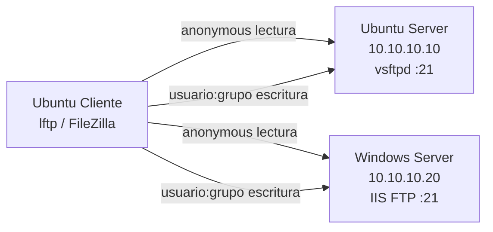

# Práctica 5 — Servidor FTP (vsftpd e IIS FTP Service)

## 1. Portada y control de versiones

| Campo | Dato |
| --- | --- |
| **Título** | FTP robusto: anónimo de lectura y usuarios por grupos `reprobados` / `recursadores` |
| **Integrantes** | *[Completar nombres]* |
| **Carrera** | *[Completar]* |
| **Asignatura** | Administración de sistemas / SysAdmin |
| **Fecha de entrega** | 25 de agosto de 2026 |
| **Entorno** | Proxmox — Ubuntu Server, Windows Server, Ubuntu Cliente |

### Registro de cambios

| Versión | Fecha | Autor | Descripción |
| --- | --- | --- | --- |
| 1.0 | 2026-08-25 | *[Completar]* | vsftpd + IIS FTP, alta masiva, jails con `general` / grupo / usuario, cambio de grupo, ACL/NTFS. |

---

## 2. Introducción y topología

FTP separa el área **pública** (`/general`: anónimo solo lee; autenticados escriben) de las áreas **de grupo** y **personales**. Los grupos del laboratorio son `reprobados` y `recursadores`. Cada usuario autenticado, al entrar, ve exactamente tres entradas en la raíz:

```
/general
/reprobados    (o /recursadores, según el grupo)
/<nombre_de_usuario>
```

El anónimo solo ve `/general` y no puede escribir.



La administración remota sigue siendo por **SSH** (Práctica 4). Suba estos scripts por `scp` y ejecute `main.sh` / `Main.ps1` dentro de la sesión SSH.

---

## 3. Arquitectura de software

```
Practica 5/
├── DOCUMENTO.md
├── linux/
│   ├── main.sh
│   └── lib/
│       ├── funciones_comunes.sh    # verificar_root, validar_usuario, instalar_paquete
│       └── ftp_functions.sh        # vsftpd, chown/chgrp/chmod/setfacl, jails bind
└── windows/
    ├── Main.ps1
    └── lib/
        ├── FuncionesComunes.ps1
        └── FuncionesFtp.ps1        # Web-FTP-Server, WebAdministration, icacls
```

```bash
source ./lib/funciones_comunes.sh
source ./lib/ftp_functions.sh
ftp_configurar
```

```powershell
. .\lib\FuncionesFtp.ps1
Install-FtpRole
Invoke-FtpBulkUsers
```

---

## 4. Manual de instalación y uso

### Pre-requisitos

- SSH funcionando hacia ambos servidores (Práctica 4).
- Ubuntu Cliente con red al laboratorio.
- Contraseñas de Windows: política de complejidad (8+ mayúscula, minúscula y número).

### 4.1 Ubuntu Server (por SSH)

```bash
cd Practica\ 5/linux
chmod +x main.sh lib/*.sh
sudo ./main.sh
```

| Opción | Acción |
| --- | --- |
| `[1]` | Instala vsftpd (idempotente), crea grupos, pide **n** usuarios (nombre, clave, grupo) |
| `[2]` | Alta de más usuarios |
| `[3]` | Cambia de grupo: desmonta la carpeta vieja y enlaza la nueva |
| `[4]` | Diagnóstico |
| `[5]` | En el **cliente**: prueba `lftp` anónimo y autenticado |

Estructura en disco (autenticado): bind mounts bajo `/srv/ftp/jails/<usuario>/`.

### 4.2 Windows Server (por SSH / PowerShell elevado)

```powershell
Set-ExecutionPolicy -Scope Process -ExecutionPolicy Bypass
cd C:\SysAdmin\Practica 5\windows
.\Main.ps1
```

Opción `[1]`: `Install-WindowsFeature Web-FTP-Server`, sitio `FTPLab` puerto 21, aislamiento `IsolateAllDirectories` (`C:\ftp\LocalUser\<usuario>`), reglas `Add-WebConfiguration` (autenticados Read+Write, anónimo `?` Read), NTFS con `icacls`.

### 4.3 Ubuntu Cliente — evidencia

**Anónimo (solo lectura de general):**

```bash
sudo ./main.sh    # opción [5]
# o:
lftp -c "set ftp:passive-mode true; open -u anonymous,anonymous ftp://10.10.10.10; ls; ls general"
```

**Autenticado (tres carpetas, escritura):**

```bash
lftp ftp://10.10.10.10
user alice
ls
cd general
put /etc/hostname
cd ../alice
mkdir prueba
```

FileZilla / MobaXterm: protocolo FTP, puerto 21, modo pasivo.

Tras **cambiar de grupo**, vuelva a entrar: debe desaparecer `reprobados` y aparecer `recursadores` (o al revés).

---

## 5. Bitácora y permisos

### Linux (`chown`, `chgrp`, `chmod`, ACL)

| Ruta | Dueño/grupo | Modo | Quién escribe |
| --- | --- | --- | --- |
| `data/general` | `root:ftpusers` | `775` + ACL grupos | Anónimo lee (`o+r-x`); `reprobados` y `recursadores` rwx |
| `data/reprobados` | `root:reprobados` | `2770` (setgid) | Solo ese grupo |
| `data/homes/<u>` | `<u>:<u>` | `700` | Solo el usuario |
| Jail | `root:root` | `755` | No escribible (vsftpd `allow_writeable_chroot=NO`) |

La vista de tres carpetas no se copia: se usa `mount --bind` persistido en `/etc/fstab`. Al cambiar de grupo se hace `umount` del bind viejo y uno nuevo.

### Windows (NTFS + WebAdministration)

- `icacls` sobre `C:\ftp\data\general`: `IUSR` RX; `reprobados` y `recursadores` M.
- Autorización FTP: usuarios `*` → Read, Write; usuario `?` (anónimo) → Read.
- Uniones NTFS (`Junction`) equivalentes a los bind mounts de Linux.
- Aislamiento IIS: cada login cae en `LocalUser\<usuario>` o `LocalUser\Public`.

### Idempotencia

Si vsftpd / Web-FTP-Server ya está, no se reinstala. Si el usuario ya existe, se actualiza clave, grupo y jail. El sitio `FTPLab` no se borra al reejecutar.

---

## 6. Protocolo de pruebas

Ejecute las pruebas **desde Ubuntu Cliente** (o FileZilla). Complete IPs reales.

| Prueba | Acción | Resultado esperado | Resultado obtenido | Estatus |
| --- | --- | --- | --- | --- |
| vsftpd instalado | Menú `[1]` Linux | `systemctl is-active vsftpd` = active | *[completar]* |  |
| IIS FTP | Menú `[1]` Windows | Sitio FTPLab Started, :21 | *[completar]* |  |
| Anónimo Linux | `lftp` anonymous | Lista `general`; `put` falla | *[completar]* |  |
| Anónimo Windows | FileZilla anonymous | Igual | *[completar]* |  |
| Login usuario | `ls` raíz | `general`, grupo, nombre | *[completar]* |  |
| Escritura general | `put` en `/general` | Archivo visible para otros del lab | *[completar]* |  |
| Escritura grupo | `put` en carpeta de grupo | OK si es su grupo; el otro grupo no lista esa carpeta | *[completar]* |  |
| Escritura personal | `mkdir` en `/usuario` | OK | *[completar]* |  |
| Cambio de grupo | Opción `[3]` y re-login | Cambia la carpeta de grupo en la raíz | *[completar]* |  |

---

## 7. Conclusiones y referencias

El requisito de “tres carpetas en la raíz” se resuelve con **jails** (bind/junctions), no con un único árbol compartido (eso mostraría las casas de todos). El anónimo usa otra raíz (`anon` / `LocalUser\Public`). En Proxmox hay que abrir **21** y el rango pasivo **30000–30100** (y el firewall del puente si aplica).

| Problema | Solución |
| --- | --- |
| `ls` cuelga tras login | Modo pasivo; `pasv_address` = IP del servidor; puertos 30000-30100 |
| 500 OOPS vsftpd | `seccomp_sandbox=NO` (ya en la plantilla) |
| Windows rechaza la clave | Cumplir complejidad; no usar 6 caracteres |
| Anónimo puede escribir | NTFS IUSR solo RX y vsftpd `anon_*_write_enable=NO` |
| Tras cambio de grupo sigue la carpeta vieja | Reconectar el cliente FTP (caché de sesión) |

Fuentes:

- [vsftpd.conf](https://security.appspot.com/vsftpd/vsftpd_conf.html)
- [Ubuntu FTP server](https://documentation.ubuntu.com/server/how-to/web-services/ftp-server/)
- [Install-WindowsFeature Web-FTP-Server](https://learn.microsoft.com/iis/publish/using-the-ftp-service/creating-a-new-ftp-site-in-iis-7)
- [IIS FTP User Isolation](https://learn.microsoft.com/iis/configuration/system.applicationhost/sites/site/ftpserver/userisolation/)
- [icacls](https://learn.microsoft.com/windows-server/administration/windows-commands/icacls)
