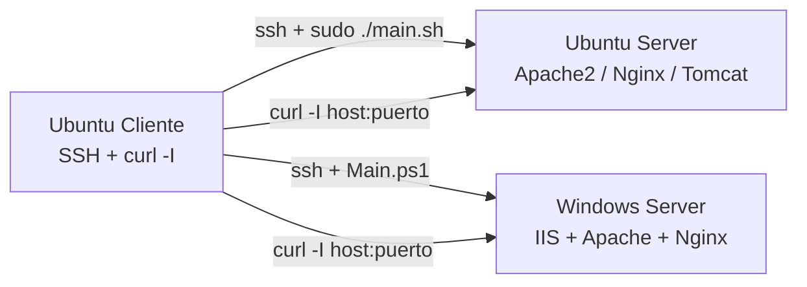

# Práctica 6 — Aprovisionamiento HTTP (Apache, Nginx, Tomcat / IIS)

## 1. Portada y control de versiones

| Campo | Dato |
| --- | --- |
| **Título** | Despliegue silencioso de servidores HTTP con menú dinámico de versiones y puerto |
| **Integrantes** | *[Completar nombres]* |
| **Carrera** | *[Completar]* |
| **Asignatura** | Administración de sistemas / SysAdmin |
| **Fecha de entrega** | 25 de agosto de 2026 |
| **Entorno** | Proxmox — Ubuntu Server, Windows Server, Ubuntu Cliente (solo SSH) |

### Registro de cambios

| Versión | Fecha | Autor | Descripción |
| --- | --- | --- | --- |
| 1.0 | 2026-08-25 | *[Completar]* | Menú dinámico apt-cache/Chocolatey, puerto validado, index.html, endurecimiento de encabezados y firewall. |

**Rúbrica:** 40 % menú dinámico + puerto en tres servicios · 30 % funciones (`http_functions.sh` / `http_functions.ps1`) · 15 % validaciones · 15 % documentación y `curl -I` por SSH.

---

## 2. Introducción y topología

El aprovisionamiento web se opera **exclusivamente por SSH** desde Ubuntu Cliente. El menú consulta versiones **en vivo** (`apt-cache madison` / `apt-cache policy` en Linux; Chocolatey o Winget en Windows). No hay versiones escritas a mano en el código.



Puertos **reservados** (no se pueden elegir): 21 FTP, 22 SSH, 53 DNS, 67/68 DHCP, 445, 3389, 3306, etc. Solo **80** o **1024–65535** libres.

---

## 3. Arquitectura

El *main* **solo** carga bibliotecas y llama al menú.

```
Practica 6/
├── DOCUMENTO.md
├── linux/
│   ├── main.sh                 # source + verificar_root + menu_http
│   └── lib/
│       ├── funciones_comunes.sh
│       └── http_functions.sh
└── windows/
    ├── Main.ps1                # dot-source + Assert-Administrator + Show-HttpMenu
    └── lib/
        ├── FuncionesComunes.ps1
        └── http_functions.ps1
```

```bash
source ./lib/http_functions.sh
menu_http
```

```powershell
. .\lib\http_functions.ps1
Show-HttpMenu
```

---

## 4. Manual (todo por SSH)

Desde el cliente:

```bash
ssh ubuntu@10.10.10.10
cd Practica\ 6/linux && chmod +x main.sh lib/*.sh && sudo ./main.sh
```

```powershell
ssh Administrador@10.10.10.20
cd C:\SysAdmin\Practica 6\windows
.\Main.ps1
```

### Linux — opciones

| Opción | Servicio | Cómo se listan versiones | Puerto |
| --- | --- | --- | --- |
| `[1]` | Apache2 | `apt-cache policy` + `madison` | `ports.conf` + VirtualHost (`sed`) |
| `[2]` | Nginx | igual | `listen` en site `lab-http` |
| `[3]` | Tomcat | apt tomcat9/10 = LTS; latest = `downloads.apache.org` (tarball) | `server.xml` Connector |
| `[4]` | Diagnóstico | `curl -I` local | |
| `[5]` | Cliente | `curl -I http://IP:PUERTO/` | |

Instalación: `apt-get install -y` (sin prompts). Si el puerto está ocupado, el script **no** continúa.

Usuario dedicado: `webnginx` (docroot `/var/www/nginx`, `chmod 750`) y `tomcat` (`nologin`, `/opt/tomcat` u webapps). Apache usa `www-data` con 750 en `/var/www/html`.

Endurecimiento Apache: `ServerTokens Prod`, `ServerSignature Off`, `TraceEnable Off`, deniego TRACE/TRACK/DELETE, `X-Frame-Options: SAMEORIGIN`, `X-Content-Type-Options: nosniff`.

Nginx: `server_tokens off;` y los mismos encabezados / métodos.

Firewall: `ufw allow $PUERTO/tcp`; si el puerto no es 80, se **cierra 80**.

### Windows

| Opción | Servicio |
| --- | --- |
| `[1]` | **IIS forzoso** (`Install-WindowsFeature Web-Server`), binding `New-WebBinding`, `removeServerHeader`, quita `X-Powered-By` |
| `[2]` | Apache Win64 — `choco search apache-httpd --all-versions` o Winget |
| `[3]` | Nginx — `choco` / `winget` |
| `[4]`/`[5]` | Diagnóstico y `curl -I` |

Chocolatey se instala solo si falta. Instalación: `choco install -y --no-progress`. Firewall: `New-NetFirewallRule HTTP-Custom-$PUERTO`; se deshabilitan reglas del puerto 80 si no se usa.

`index.html` en cada docroot:

`Servidor: [Nombre] - Versión: [Elegida] - Puerto: [Puerto]`

---

## 5. Bitácora

- **Versiones:** `apt-cache madison apache2 \| awk '{print $3}'` (equivalente encapsulado). Windows: `choco info`/`search --all-versions`.
- **Puerto ocupado:** `ss` / `Get-NetTCPConnection -State Listen`.
- **Página:** función `http_escribir_index` / `Write-HttpIndex`.
- **Main lineal:** prohibido; `main.sh` tiene tres llamadas.

---

## 6. Checklist (`curl -I` desde el cliente)

| Prueba | Acción | Esperado | Obtenido | Estatus |
| --- | --- | --- | --- | --- |
| Apache Linux | Menú `[1]`, puerto 8080 | `curl -I http://10.10.10.10:8080/` cuerpo con Apache+versión+8080; `Server` genérico | | |
| Nginx Linux | `[2]` | Igual, sin versión en `Server` | | |
| Tomcat | `[3]` LTS o latest | HTTP 200 en el puerto elegido | | |
| IIS | Windows `[1]` | Sin `X-Powered-By`; binding correcto | | |
| Puerto ocupado | Elegir 22 o 21 | Rechazo | | |
| Firewall | nmap/ufw 80 tras elegir 8080 | 80 cerrado, 8080 abierto | | |
| TRACE | `curl -X TRACE` | 405 / denegado | | |

Adjunte capturas de **encabezados** (`curl -I`) tomadas en la sesión SSH del cliente.

---

## 7. Conclusiones y referencias

Si `apt-cache madison` solo devuelve una línea, esa es la LTS del Ubuntu del laboratorio; Tomcat aporta el “Latest” desde apache.org. Chocolatey necesita salida a Internet desde Windows Server.

| Problema | Solución |
| --- | --- |
| `apache2=versión` no instala | El script hace fallback a `apt-get install -y apache2` |
| curl cuelga | Firewall Proxmox / pasivo no aplica a HTTP; abrir el puerto en UFW y en el puente |
| IIS removeServerHeader | Requiere IIS 10; si falla, igual se quita X-Powered-By |
| Tomcat tarball 404 | La versión latest se leyó del listing; si cambió el espejo, use la opción apt |

Fuentes:

- [apt-cache](https://manpages.ubuntu.com/manpages/jammy/man8/apt-cache.8.html)
- [Apache ServerTokens](https://httpd.apache.org/docs/2.4/mod/core.html#servertokens)
- [nginx server_tokens](https://nginx.org/en/docs/http/ngx_http_core_module.html#server_tokens)
- [Install-WindowsFeature Web-Server](https://learn.microsoft.com/iis/install/installing-iis-7/installing-iis-on-windows-server-2008)
- [requestFiltering removeServerHeader](https://learn.microsoft.com/iis/configuration/system.webserver/security/requestfiltering/)
- [Chocolatey](https://docs.chocolatey.org/en-us/choco/commands/info)
