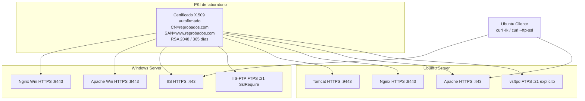

# Práctica 7 — Orquestador WEB/FTP y SSL/TLS en 8 instancias

## 1. Portada y control de versiones

| Campo | Dato |
| --- | --- |
| **Título** | PKI autofirmada `reprobados.com`, FTPS/HTTPS y repositorio FTP con integridad SHA256 |
| **Integrantes** | *[Completar nombres]* |
| **Carrera** | *[Completar]* |
| **Asignatura** | Administración de sistemas / SysAdmin |
| **Fecha de entrega** | 25 de agosto de 2026 |
| **Operación** | Solo SSH desde Ubuntu Cliente |

### Registro de cambios

| Versión | Fecha | Autor | Descripción |
| --- | --- | --- | --- |
| 1.0 | 2026-08-25 | *[Completar]* | Navegación FTP con curl, hashes, SSL en 4 servicios Linux + 4 Windows, resumen automático. |

**Rúbrica:** 35 % cliente FTP dinámico · 35 % SSL/TLS (8 canales, CN `reprobados.com`) · 15 % hash · 15 % documentación y evidencias.

---

## 2. Infraestructura PKI

Un certificado **autofirmado** por sistema operativo (no hay CA intermedia). El mismo par se reutiliza en los cuatro servicios de esa máquina.



**Por qué no todos usan 443:** en cada servidor conviven tres HTTP. Solo uno puede enlazar 443. El orquestador pregunta el puerto TLS; valores por defecto: Apache/IIS **443**, Nginx **8443**, Tomcat/Apache-Win **9443**. HSTS y redirección HTTP→HTTPS se aplican al puerto TLS de ese servicio.

Archivos:

- Linux: `/etc/ssl/reprobados/reprobados.com.{crt,key}` + `tomcat.p12`
- Windows: `Cert:\LocalMachine\My` + `C:\ssl\reprobados\reprobados.pfx`

Generación Linux: `openssl req -x509 -nodes -days 365 -newkey rsa:2048` con SAN. Windows: `New-SelfSignedCertificate -DnsName "reprobados.com","www.reprobados.com"`.

---

## 3. Arquitectura de software

```
Practica 7/
├── DOCUMENTO.md
├── linux/
│   ├── main.sh
│   └── lib/
│       ├── funciones_comunes.sh
│       ├── ftp_repo_functions.sh    # preparar repo, curl, SHA256
│       ├── ssl_functions.sh
│       └── orquestador_functions.sh
└── windows/
    ├── Main.ps1
    └── lib/
        ├── FuncionesComunes.ps1
        ├── ftp_repo_functions.ps1
        ├── ssl_functions.ps1
        └── orquestador_functions.ps1
```

`main.sh` / `Main.ps1` **solo** hacen `source`/`.` y llaman al menú.

### Repositorio FTP (Práctica 5)

Visible en la raíz FTP como `/http/...` (bind/junction sobre `data/http`):

```
http/
  Linux/Apache/*.deb + *.sha256
  Linux/Nginx/*.deb + *.sha256
  Linux/Tomcat/*.tar.gz + *.sha256
  Windows/IIS/
  Windows/Apache/*.msi|zip + *.sha256
  Windows/Nginx/*.zip + *.sha256
```

Si falta el `.sha256`/`.md5`, **no se instala** (15 % integridad).

---

## 4. Manual (SSH)

### 4.1 Sembrar el FTP (en el servidor que tiene vsftpd / IIS-FTP)

```bash
# Ubuntu Server
sudo ./main.sh    # [1] Preparar repositorio
```

Copia `apache2_*.deb`, `nginx_*.deb` y el tarball de Tomcat con su SHA256. Los clientes anónimos leen `ftp://10.10.10.10/http/Linux/Apache/`.

En Windows: `[1]` crea carpetas y copia artefactos de la caché Chocolatey si existen; puede colocar a mano `.msi`/`.zip` y generar hash.

### 4.2 Instalar

| Opción | Origen |
| --- | --- |
| `[2]` WEB | `apt -y` / `Install-WindowsFeature` / `choco -y` |
| `[3]` FTP | Lista `/http/<OS>/`, entra al servicio, lista binarios, `curl -O`, `sha256sum -c` / `Get-FileHash` |

Tras instalar pregunta: **¿Desea activar SSL en este servicio? [S/N]**

### 4.3 Cifrar servicios ya instalados

`[4]` por servicio o los 4. vsftpd: `ssl_enable=YES`, `force_local_*_ssl=YES`. IIS-FTP: `SslRequire` en control y datos.

### 4.4 Evidencias de las 8 conexiones (cliente)

```bash
sudo ./main.sh    # [6]
```

| # | Destino | Prueba |
| --- | --- | --- |
| 1 | Linux FTPS | `curl -k --ftp-ssl ftp://10.10.10.10/` |
| 2 | Linux Apache | `curl -Ik --resolve reprobados.com:443:10.10.10.10 https://reprobados.com/` |
| 3 | Linux Nginx | igual, puerto **8443** |
| 4 | Linux Tomcat | puerto **9443** |
| 5 | Windows FTPS | `curl -k --ftp-ssl ftp://10.10.10.20/` |
| 6 | Windows IIS | HTTPS **443** |
| 7 | Windows Apache | **8443** |
| 8 | Windows Nginx | **9443** |

El subject del certificado debe incluir **reprobados.com**. HTTP en 80 debe responder **301** hacia HTTPS (Apache/Nginx).

---

## 5. Checklist

| Prueba | Esperado | Obtenido | Estatus |
| --- | --- | --- | --- |
| Navegar FTP | Menú de carpetas reales, no rutas quemadas | | |
| Hash corrupto | Cambiar 1 byte del .deb y reejecutar → aborta | | |
| CN | `openssl x509 -noout -subject` = reprobados.com | | |
| 8 canales | Las 8 pruebas `[6]` con TLS | | |
| HSTS | Encabezado `Strict-Transport-Security` | | |

---

## 6. Conclusiones y referencias

El cliente FTP **no usa GUI**: solo `curl --list-only` / `FtpWebRequest`. Tres HTTP en un solo host obligan a **puertos TLS distintos**. FTPS explícito en 21 evita chocar con HTTPS.

| Problema | Solución |
| --- | --- |
| `curl` lista vacío | Trailing slash en la URL FTP; usuario anónimo y carpeta `http` bind |
| `sha256sum -c` falla | El `.sha256` debe nombrarse igual que el binario (formato `hash  archivo`) |
| Tomcat no abre 443 | Usuario `tomcat` sin CAP_NET_BIND; use 9443 |
| Cert Windows sin PEM | `choco install openssl` para extraer `.crt/.key` del PFX |
| Self-signed en curl | `-k` / `--insecure` en el lab |

Fuentes:

- [openssl req](https://www.openssl.org/docs/man3.0/man1/openssl-req.html)
- [vsftpd SSL](https://security.appspot.com/vsftpd/vsftpd_conf.html)
- [New-SelfSignedCertificate](https://learn.microsoft.com/powershell/module/pki/new-selfsignedcertificate)
- [Get-FileHash](https://learn.microsoft.com/powershell/module/microsoft.powershell.utility/get-filehash)
- [curl FTP](https://curl.se/docs/manpage.html)
