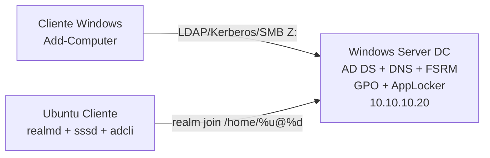

# Práctica 8 — AD, GPO, FSRM y AppLocker

## 1. Portada y control de versiones

| Campo | Dato |
| --- | --- |
| **Título** | Gobernanza de datos: UO Cuates/No Cuates, logonHours, FSRM y AppLocker por hash |
| **Integrantes** | *[Completar nombres]* |
| **Carrera** | *[Completar]* |
| **Infraestructura** | **1** Windows Server (DC + archivos) · **1** cliente Windows · **1** cliente Ubuntu |
| **Fecha** | 25 de agosto de 2026 |

### Registro de cambios

| Versión | Fecha | Autor | Descripción |
| --- | --- | --- | --- |
| 1.0 | 2026-08-25 | *[Completar]* | CSV 10 usuarios, Set-ADUser LogonHours, GPO force logoff, cuotas 5/10 MB, Active Screen, AppLocker hash. |

**Rúbrica:** 40 % cuotas FSRM · 30 % AppLocker (hash, incluso renombrado) · 15 % logoff al expirar horario · 15 % documento + eventos FSRM.

---

## 2. Topología



DNS de **ambos clientes** = IP del DC (no el BIND de prácticas anteriores), para resolver `_ldap._tcp.reprobados.com`.

---

## 3. Arquitectura

```
Practica 8/
├── DOCUMENTO.md
├── usuarios.csv                 # 5 Cuates + 5 NoCuates
├── windows-server/
│   ├── Main.ps1
│   └── lib/ FuncionesComunes, AD, Gpo, Fsrm, AppLocker
├── windows-cliente/
│   └── Unir-Dominio.ps1
└── linux-cliente/
    ├── main.sh
    └── lib/ funciones_comunes.sh, dominio_functions.sh
```

Distribución CSV: columna `Departamento` = `Cuates` o `NoCuates` → UO `Cuates` / `No Cuates`.

| Grupo | Logon hours (local) | Cuota home `Z:` | Notepad |
| --- | --- | --- | --- |
| Cuates | 08:00–15:00 | 10 MB hard | Permitido (path Windows) |
| NoCuates | 15:00–02:00 | 5 MB hard | **Deny por hash** |

Active Screen en `C:\P8Homes`: `*.mp3`, `*.mp4`, `*.exe`, `*.msi`.

GPO: *Network security: Force logoff when logon hours expire* (`ForceLogoffWhenHourExpire = 1`).

Linux: `fallback_homedir = /home/%u@%d` y `/etc/sudoers.d/ad-admins`.

---

## 4. Manual (orden)

### 4.1 Windows Server (único servidor)

```powershell
cd C:\SysAdmin\Practica 8\windows-server
Set-ExecutionPolicy -Scope Process Bypass
.\Main.ps1
```

1. `[1]` roles  
2. `[2]` promover bosque `reprobados.com` (**reinicio**)  
3. Tras el reboot: `[3]` con `usuarios.csv`  
4. `[4]` GPO logoff · `[5]` FSRM · `[6]` AppLocker  
5. Copie `usuarios.csv` junto al repo si la ruta por defecto no existe.

Sincronice **zona horaria** del DC y de los clientes (los bits de `logonHours` se convierten a UTC).

### 4.2 Cliente Windows

```powershell
.\Unir-Dominio.ps1
```

`Add-Computer` + DNS al DC + reinicio. Luego `gpupdate /force`. Inicie sesión como `cuate01` / `nocuate01`. La unidad `Z:` es el home en `\\DC\P8Homes\...`.

### 4.3 Ubuntu Cliente

```bash
sudo ./main.sh    # [1] realm join
id cuate01@reprobados.com
```

---

## 5. Protocolo de pruebas (evidencias)

| Test | Acción | Esperado | Evidencia |
| --- | --- | --- | --- |
| 1 Horario | Iniciar sesión con **cuate01** (Grupo 1) a las **16:00** (fuera de 8:00–15:00) | Windows: restricción de cuenta / logon denegado | Captura del mensaje |
| 2 Force logoff | `nocuate01` ~01:55, esperar 02:00 | Cierre de sesión / pantalla de bloqueo | Captura |
| 3 Cuota | Copiar 15 MB a `Z:` de un cuate (10 MB) | Espacio insuficiente | Propiedades del volumen + error |
| 4 Screen | Guardar `.mp3` o `.exe` en `Z:` | Bloqueo de escritura | FSRM (grupo P8-Multimedia-Ejecutables) + evento SRM |
| 5 AppLocker | NoCuates: notepad y copia `calculo.exe` | “bloqueada por el administrador” | Ambas ventanas |

Eventos FSRM: Visor de eventos → **Aplicación** → origen **SRMSVC** / File Server Resource Manager (el File Screen dispara un evento Warning con el cuerpo P8).

Generar 15 MB de prueba en el cliente:

```powershell
fsutil file createnew C:\temp\15mb.bin 15728640
Copy-Item C:\temp\15mb.bin Z:\
```

---

## 6. Conclusiones y referencias

AppLocker **Deny hash** no depende del nombre del archivo; por eso `calculo.exe` sigue bloqueado. Las cuotas son **hard** (no soft). Si el cliente es Windows 11 y Notepad es Store, el hash de `System32\notepad.exe` del DC puede no coincidir: regenere el GPO con el hash del cliente.

| Problema | Solución |
| --- | --- |
| realm discover falla | DNS del Ubuntu = DC; firewall 88, 389, 445, 53 |
| Logon hours corridos | Misma zona horaria; bits en UTC |
| AppLocker no aplica | AppIDSvc automático; gpupdate; SKU Pro/Enterprise/Server |
| Cuota no actúa | Home debe ser `C:\P8Homes\...` no una carpeta local del cliente |

Fuentes:

- [Set-ADUser LogonHours](https://learn.microsoft.com/powershell/module/activedirectory/set-aduser)
- [Force logoff when logon hours expire](https://learn.microsoft.com/windows/security/threat-protection/security-policy-settings/network-security-force-logoff-when-logon-hours-expire)
- [New-FsrmQuota](https://learn.microsoft.com/powershell/module/fileserverresourcemanager/new-fsrmquota) / [New-FsrmFileScreen](https://learn.microsoft.com/powershell/module/fileserverresourcemanager/new-fsrmfilescreen)
- [Get-AppLockerFileInformation](https://learn.microsoft.com/powershell/module/applocker/get-applockerfileinformation)
- [realm join](https://www.freedesktop.org/software/realmd/adcli/realmd.html)
